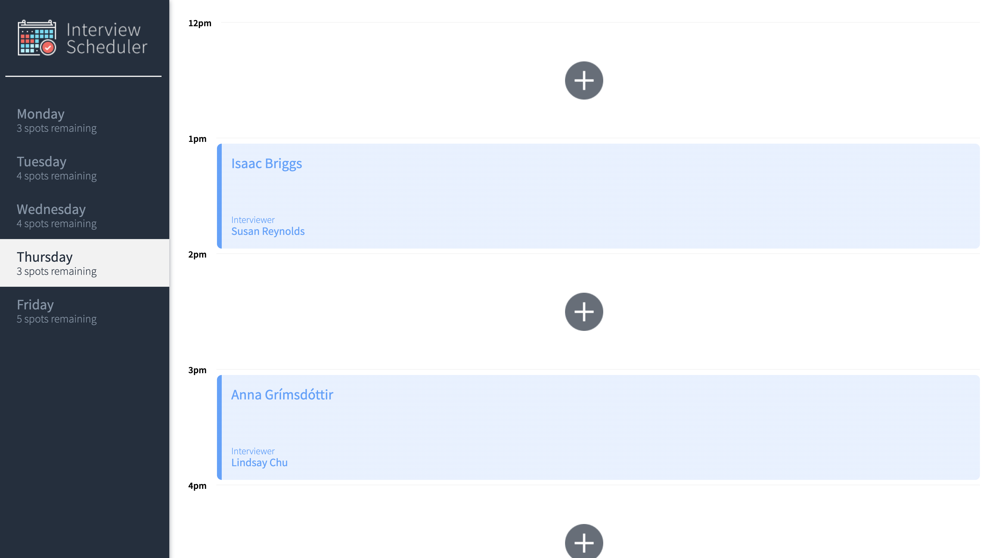
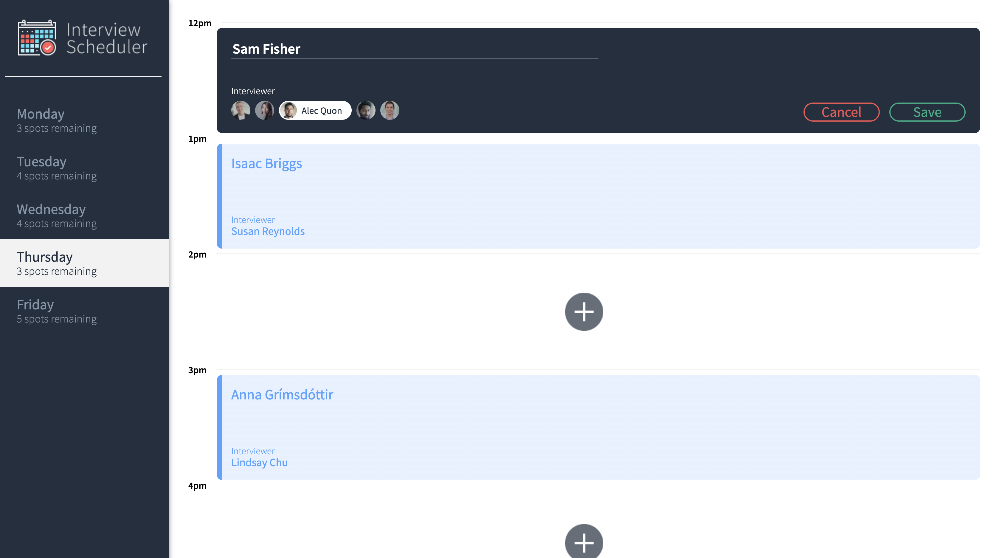
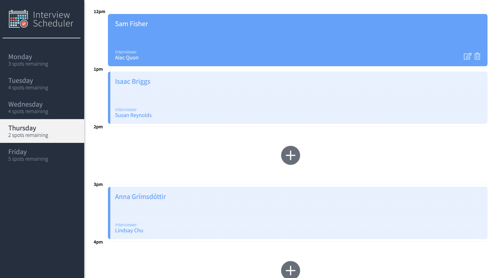

# Interview Scheduler

A single-page web application that allows users to book, edit, and cancel interviews.

This project has support for WebSocket connections - when a user creates or deletes an appointment, it updates the schedule across all interfaces in real-time.

**Test:** Jest, Cypress
**Back-End:** Node, Express, PostgreSQL
**Front-End:** React, Storybook, Sass, WebSockets

# Website

[Click here to see this website live](https://suspicious-snyder-27f3ef.netlify.app/).

# Screenshots

# Installation

1. Clone this repository into your machine.

2. Install dependencies using the `npm install` command.

3. Start the web server using the `npm run start` command. The app will be served at `http://localhost:8000/`.

4. Book your first appointment!

# Dependencies

- axios
- react
- express
- react-dom
- classnames
- react-scripts
- normalize.css
- NPM 5.x or above
- Node 10.x or above
